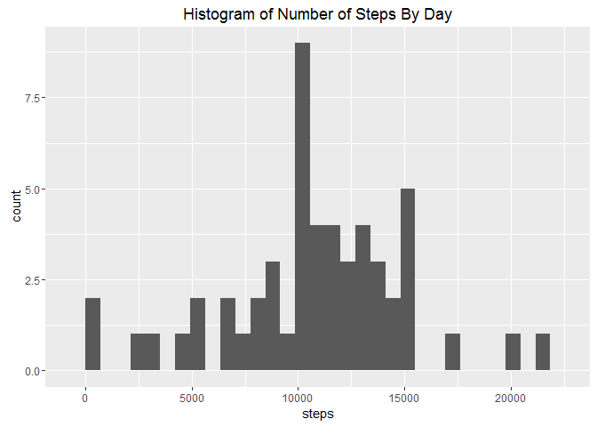
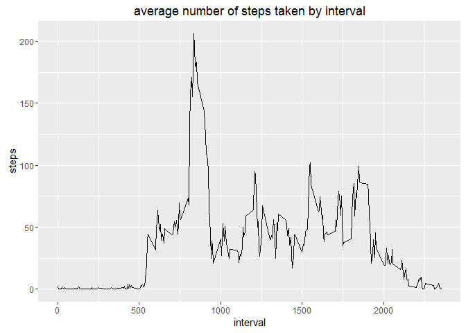
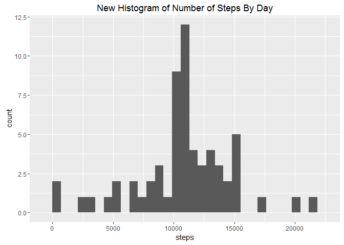
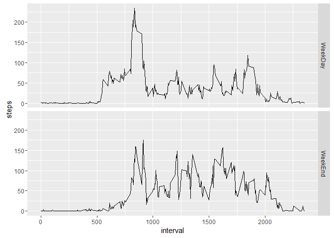

# Reproducible Research: Peer Assessment 1


## Loading and preprocessing the data


```r
require(ggplot2)
```

```
## Loading required package: ggplot2
```

```r
library (ggplot2)
#1.1
 setwd('C:\\Users\\Alexandre\\Documents\\DataAnalysisScripts\\Reproducible Research')
activity <- read.csv("activity.csv")
```


## What is mean total number of steps taken per day?

```r
#1
StepsByDate<-aggregate(. ~ date, data=activity, FUN = sum)
#2
with(StepsByDate,qplot(steps, geom="histogram",main = "Histogram of Number of Steps By Day"))
```

```
## `stat_bin()` using `bins = 30`. Pick better value with `binwidth`.
```



```r
#3
mean(StepsByDate$steps)
```

```
## [1] 10766.19
```

```r
median(StepsByDate$steps)
```

```
## [1] 10765
```

## What is the average daily activity pattern?


```r
#1
meanOfStepsByInterval<-aggregate(steps ~ interval, data=activity, FUN = mean)
with(meanOfStepsByInterval,qplot(x=interval,y=steps,geom = 'line',main = 'average number of steps taken by interval'))
```



```r
#2
meanOfStepsByInterval[which.max(meanOfStepsByInterval$steps),]
```

```
##     interval    steps
## 104      835 206.1698
```
The 5-minute interval that contains the maximum number of steps is the interval 835


## Imputing missing values
The Number of NA's is:

```r
#1
sum(is.na(activity))
```

```
## [1] 2304
```
I substitute by the mean of steps by interval of all the days. (this info was calculated in the previous question)

```r
#2

listOfNA<-is.na(activity)

justNARows<-which(listOfNA==TRUE)

newDataSet<-activity

for (i in justNARows){
  rowOfInterval<-which(meanOfStepsByInterval$interval==activity[i,'interval'])
  newDataSet[i,'steps']<-meanOfStepsByInterval[rowOfInterval,'steps']
  
}
```
Creating The DataSet...

```r
#3

StepsByDateNewData<-aggregate(steps ~ date, data=newDataSet, FUN = sum)
```
Histogram and Mean and Median.

```r
#4.4
with(StepsByDateNewData,qplot(steps, geom="histogram",main = "New Histogram of Number of Steps By Day"))
```

```
## `stat_bin()` using `bins = 30`. Pick better value with `binwidth`.
```



```r
summary(StepsByDateNewData$steps)
```

```
##    Min. 1st Qu.  Median    Mean 3rd Qu.    Max. 
##      41    9819   10770   10770   12810   21190
```

```r
summary(StepsByDate$steps)
```

```
##    Min. 1st Qu.  Median    Mean 3rd Qu.    Max. 
##      41    8841   10760   10770   13290   21190
```

As we can see, the Median is now different.


## Are there differences in activity patterns between weekdays and weekends?

Creating the factor variable

```r
require(lubridate)
```

```
## Loading required package: lubridate
```

```r
library(lubridate)
weekdays(ymd(activity[1,'date']),abbreviate = TRUE)
```

```
## [1] "seg"
```

```r
weekFactor <- as.factor(c('WeekDay','WeekEnd'))
activity$week<-weekFactor[1]

weekDays <- c("seg","ter","qua","qui","sex")
for (i in 1:dim(activity)[1]){
  if (weekdays(ymd(activity[i,'date']),abbreviate = TRUE) %in% weekDays){
    activity[i,'week'] <- 'WeekDay'
  }else{
    activity[i,'week'] <- 'WeekEnd'
    
  }

}
```

The plot containing a time series of the 5-minute interval and the average number of steps taken, averaged across all weekday days or weekend days.


```r
finalData<-aggregate(steps ~ week + interval, data=activity,FUN=mean)

qplot(data = finalData, x=interval,y=steps,geom='line',facets = week~.)
```



